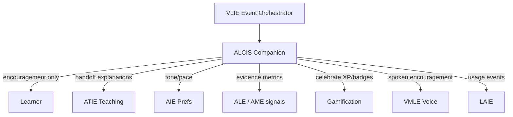

# AI Learning Companion Intelligence System (ALCIS)

**Product:** Alora AI / EduAdapt  
**Smoke:** `ALCIS_SMOKE_OK`  
**Package:** `engines/learning_companion_engine/`  
**VLIE id:** `learning_companion`

ALCIS is the **emotional and motivational layer** — not an AI Tutor. ATIE teaches; the companion builds trust, confidence, persistence, and long-term engagement **without changing academic content**.

---

## 1. Architecture



**Hard policy:** never teach · never invent curriculum · never give clinical advice · never store medical diagnoses.

---

## 2. Component diagram

| Module | Role |
|--------|------|
| `avatars.py` / `personality.py` | Companion library + styles |
| `learner_memory.py` | Persistent prefs & achievements |
| `motivation.py` / `encouragement.py` | Evidence-based praise |
| `celebration.py` / `rewards.py` | Milestones + gamification bridge |
| `wellbeing.py` / `emotions.py` | Supportive (non-clinical) responses |
| `executive_function.py` | Planning / initiation / breaks |
| `dialogue.py` | Greetings + ATIE handoff |
| `accessibility.py` | Consume AIE |
| `analytics.py` | → LAIE + dashboard shapes |
| `companion_manager.py` | Action orchestration |
| `service.py` / `engine.py` | APIs + VLIE facade |

---

## 3. Personality framework

**Companions:** Reading Owl, Science Robot, Math Dragon, Focus Fox, History Explorer, Nature Guardian, Coding Penguin, Language Parrot, Study Panda, University Mentor, Career Coach.

**Styles:** Gentle Coach, Cheerful Friend, Curious Explorer, Calm Mentor, Energetic Motivator, Professional Mentor.

Selectable by learners; constrainable by teachers.

---

## 4. Memory model

Persisted under `data/knowledge/alcis/learners/{learner_id}.json`:

preferred companion, communication style, motivation prefs, achievements, streaks, favorite subjects, confidence/support areas, **functional** accessibility prefs (from AIE), encouragement style, pacing, reflections, goals, voice preference.

Banned fields: diagnosis / medical / clinical labels.

---

## 5. Event flow (VLIE)

`CompanionEncouraged`, `CompanionCelebrated`, `CompanionCheckIn`, plus handoff via `TutorQuestionAsked`.

---

## 6. APIs (`service.py`)

| API | Purpose |
|-----|---------|
| `api_select_companion` | Choose companion |
| `api_update_personality` | Switch style |
| `api_retrieve_learner_memory` | Persistent memory |
| `api_log_encouragement` | Evidence-based nudge |
| `api_record_celebration` | Celebrate milestone |
| `api_get_motivation_profile` | Motivation signals |
| `api_update_goals` | Long-term goals |
| `api_retrieve_companion_analytics` | Usage → LAIE shape |
| `api_wellbeing_support` / `api_ef_coach` / `api_handoff_atie` | Support & handoff |
| `api_list_companions` | Library |

---

## 7. Accessibility integration

Consumes AIE for tone, pace, encouragement frequency, visual complexity, reading level, audio usage, reminder frequency — **presentation only**.

---

## 8. Privacy & security

- No medical diagnoses stored.
- No clinical mental-health advice.
- Prefer on-device voice via VMLE; minimize retained audio.
- Tenant isolation via learner_id paths; encrypt at rest in production.

---

## 9. Testing & deployment

```bash
pip install -r requirements-dev.txt
pytest tests/test_alcis.py -v
```

Smoke prints **`ALCIS_SMOKE_OK`**.

Registered in `engine_manager` with depends_on: accessibility, ai_tutor, adaptive_learning, gamification, voice_multimodal.

---

## 10. Migration notes

| Before | After |
|--------|-------|
| Planned `learning_companion` slot | Real ALCIS engine |
| ATIE `motivation_nudge` (tutor-scoped) | ALCIS owns persistent companion motivation |
| Gamification stub XP/badges | ALCIS celebrates; gamification remains economy owner |

No changes to VLIE/KIE/CIE/AME/AIE/ALE/LAIE/ATIE/VMLE domain logic.
