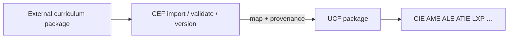

# Curriculum Expansion Framework (CEF)

**Smoke:** `CURRICULUM_EXPANSION_FRAMEWORK_SMOKE_OK`  
**Package:** `engines/curriculum_expansion_framework/` (`engine_id=curriculum_expansion`)  
**Target schema:** UCF (`ucf/1.0`) — all intelligence engines continue to consume UCF only.

CEF enables multi-board ingest without rewriting VLIE, CIE, AME, LXP, or other engines.

---

## Architecture



**Rule:** No board-specific branches inside teaching/assessment engines. New boards = new CEF importers only.

---

## Incremental population order

1. **NCERT + CBSE** (seeded Class 8 Science Force & Pressure)  
2. ICSE / ISC  
3. Cambridge programmes  
4. IB PYP / MYP / DP  
5. Kerala State Board  
7. Universities / colleges / foundation  
8. Professional / corporate / CPD  

Catalogue stubs exist for all families; full corpora are imported later.

### Phase 3 — Indian boards (pilots)

Use `api_seed_indian_boards()` (CEF) or `api_ingest_indian_boards()` (CMIF mandatory pipeline):

- ICSE Class 8 Physics  
- ISC Class 11 Physics  
- Kerala SCERT Class 8 Science  
- NIOS Secondary Science  

Smoke: `CMIF_PHASE3_INDIAN_BOARDS_SMOKE_OK`

### Phase 4 — International (pilots)

Use `api_seed_international()` or `api_ingest_international()`:

- Cambridge Primary / Lower Secondary / IGCSE / AS & A Level  
- IB PYP / MYP / DP  

Smoke: `CMIF_PHASE4_INTERNATIONAL_SMOKE_OK`

### Phase 5 — Higher education & professional (pilots)

Use `api_seed_higher_ed()` or `api_ingest_higher_ed()`:

- University / College / Foundation  
- Professional certification / Corporate L&D / CPD  

Smoke: `CMIF_PHASE5_HIGHER_ED_SMOKE_OK`

---

## Import pipeline

1. Resolve `curriculum_id` in family registry  
2. CEF validation (reject incomplete)  
3. Map → UCF payload (`mapping.py`)  
4. Attach provenance  
5. Snapshot (version history)  
6. Persist via UCF `import_curriculum`  
7. Update registry import / validation / publication status  

---

## Mapping rules

External fields reshape into UCF topics/concepts. Required map fields tracked for completeness scoring. CEF never invents academic content.

## Validation rules

**Errors (reject):** missing board/subject/grade, missing topics, incomplete LOs, broken formula integrity.  
**Warnings:** missing competencies, assessments, diagrams, glossary, accessibility metadata.

## Versioning

Draft → validated → published; snapshots, compare, rollback under `data/knowledge/cef/versions/`.

## Cross-board equivalency

Deterministic token overlap on UCF topic titles/objectives (no LLM equivalence claims).

## Localization

UI/search terminology aliases only — **never auto-translate verified curriculum**.

---

## APIs (`service.py`)

| API | Purpose |
|-----|---------|
| `api_list_supported_boards` | Catalogue |
| `api_import_curriculum_package` | Import → UCF |
| `api_validate_package` | Pre-publish checks |
| `api_publish_package` | Publish registry + activate UCF |
| `api_retrieve_curriculum_metadata` | Registry entry |
| `api_search_curriculum` | Registry + UCF search |
| `api_compare_curricula` | Equivalency |
| `api_version_history` / `api_compare_versions` / `api_rollback` | Versioning |
| `api_dashboard` | Admin coverage |
| `api_seed_priority` | NCERT+CBSE seeds |

---

## Deployment

1. Ensure `data/knowledge/cef/` writable (gitignored).  
2. Run `api_seed_priority()` in staging to validate pipeline.  
3. Import additional boards via `api_import_curriculum_package` with licensed packages only.  
4. Engines need **no** code changes for new boards.

---

## Testing

```bash
pytest tests/test_cef.py -v
```

Smoke prints **`CURRICULUM_EXPANSION_FRAMEWORK_SMOKE_OK`**.
