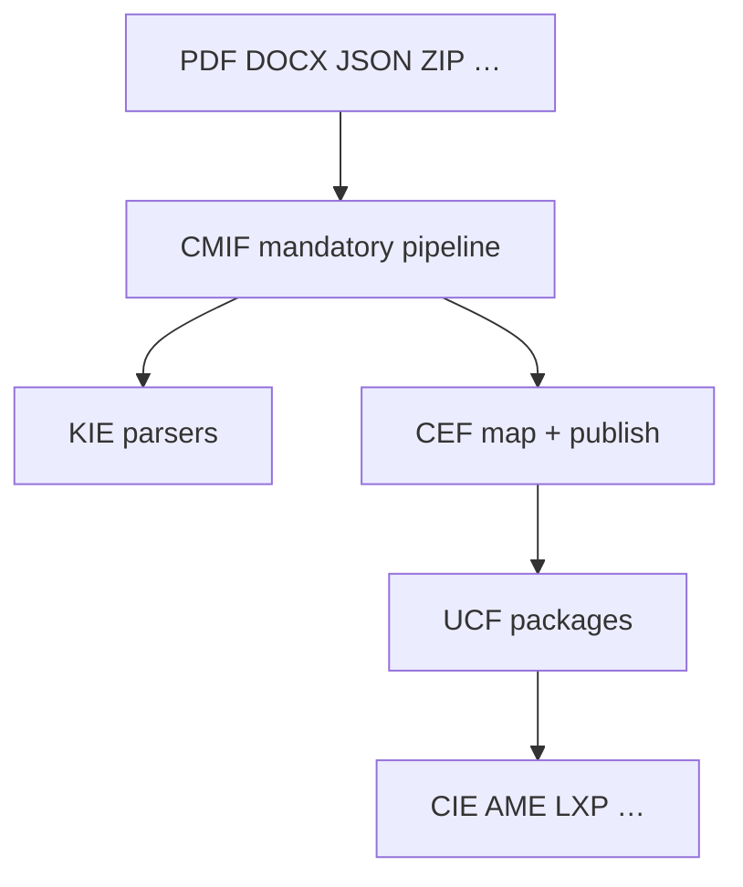

# Curriculum Migration & Ingestion Framework (CMIF)

**Smoke:** `CURRICULUM_MIGRATION_FRAMEWORK_SMOKE_OK`  
**Package:** `engines/curriculum_migration_framework/` (`engine_id=curriculum_migration`)  
**Target:** UCF only — reuses **KIE** (parsers), **CEF** (map/publish), **UCF** (schema/index)

CMIF is the production ingestion layer. It does **not** generate curriculum and does **not** replace engines.

---

## Architecture



### Mandatory pipeline (no bypass)

Import → Validate → Normalize → Map UCF → Extract (metadata, LOs, assessments, diagrams, formulae, glossary, a11y) → Knowledge graph → Semantic chunks → Vector index → Version → QA → Publish

---

## Phase roadmap (content acquisition)

1. **Framework** (shipped)  
2. NCERT Classes 1–12 + CBSE competencies (pilot packs)  
3. **ICSE / ISC / Kerala / NIOS** — pilots shipped  
4. **Cambridge / IB** — pilots shipped  
5. **University + professional** — pilots shipped (`api_ingest_higher_ed`, `api_seed_higher_ed`)  

### Phase 5 pilots

| Family | Programme | Pilot package |
|--------|-----------|---------------|
| Higher ed | University | Year-1 Physics — Newton / work–energy |
| Higher ed | College | Diploma Applied Science — measurement / forces |
| Higher ed | Foundation | STEM bridge — algebra + forces |
| Professional | Certification | STEM pedagogy — verified teaching |
| Professional | Corporate | Workplace safety L1 |
| Professional | CPD | Digital pedagogy / adaptive pathways |

Smoke: **`CMIF_PHASE5_HIGHER_ED_SMOKE_OK`**

---

## Security

- SHA-256 source hash + optional checksum verify  
- Filename sanitization  
- Duplicate hash detection  
- Immutable published versions (new version on republish)  
- Role gate for publish (`curriculum_publisher` / admin / system)  
- JSONL audit trail under `data/knowledge/cmif/audit/`

---

## APIs (`service.py`)

`api_import_curriculum` · `api_validate_curriculum` · `api_publish_curriculum` · `api_archive_curriculum` · `api_rollback_version` · `api_search_curriculum` · `api_compare_curricula` · `api_retrieve_metadata` · `api_retrieve_package` · `api_list_supported_boards` · `api_get_import_status` · `api_dashboard` · `api_enqueue` / `api_process_queue` / `api_resume`

---

## Deployment

1. Writable `data/knowledge/cmif/` (gitignored).  
2. Prefer licensed JSON/ZIP packages for Phase 2+; PDF/DOCX via KIE.  
3. New boards = new adapters / CEF family entries — **no engine code changes**.

---

## Testing

```bash
pytest tests/test_cmif.py -v
```

Smoke: **`CURRICULUM_MIGRATION_FRAMEWORK_SMOKE_OK`**
