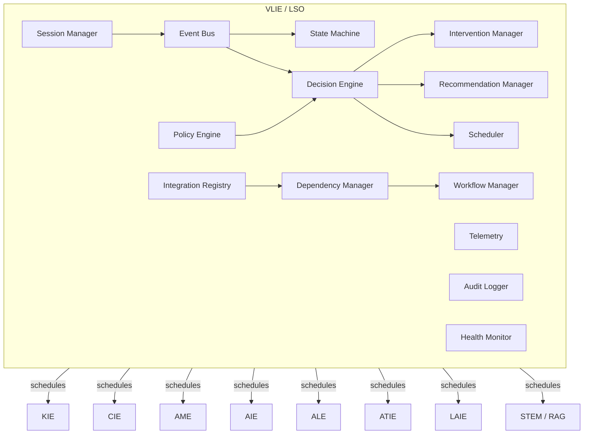
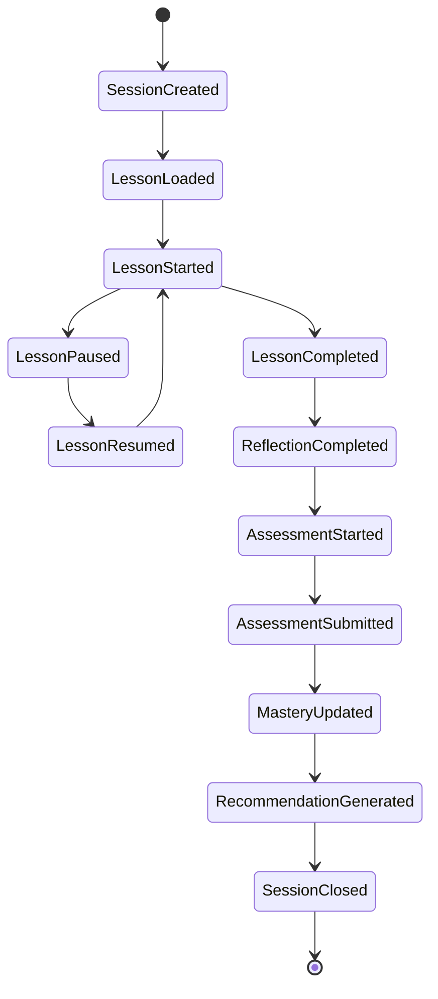
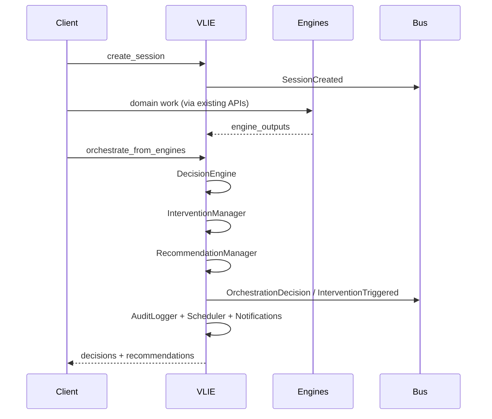

# Event-Driven VLIE Architecture — Learning Session Orchestrator (LSO)

**Product:** Alora AI / EduAdapt  
**Date:** 2026-07-17  
**Smoke marker:** `VLIE_ORCHESTRATION_SMOKE_OK`

VLIE remains the **single** top-level orchestration package. This upgrade extends it into an event-driven **Learning Session Orchestrator** without replacing KIE, CIE, AME, AIE, ALE, LAIE, ATIE, STEM engines, RAG, or Chroma.

---

## 1. Platform law (unchanged)

1. Knowledge Layer — NCERT / CBSE / banks / RAG  
2. Computation Layer — SymPy / ChemPy / validators  
3. Teaching Layer — AI explains only; never invents official answers  

VLIE **coordinates**; domain engines **own** expertise.

---

## 2. Component diagram



---

## 3. Session lifecycle



Timestamps are stored per stage in `stage_timestamps`.

---

## 4. Learner state machine

States: Preparing → Reading / Listening / Watching / Practicing / Requesting Help / Reflecting / Assessing / Reviewing / Completed / Interrupted / Offline / Resuming  

Transitions are deterministic (`state_machine.py`). Unknown transitions are no-ops.

---

## 5. Event catalogue

Immutable `LearningEvent` records (`event_registry.py`): LessonOpened, LessonLoaded, LessonCompleted, HintRequested, HintDelivered, TutorQuestionAsked, TutorResponseReceived, DiagramViewed, AudioPlayed, AccessibilityChanged, ConfidenceChanged, MisconceptionDetected, InterventionTriggered, AssessmentStarted, AssessmentCompleted, MasteryUpdated, GoalAchieved, XPAwarded, BadgeUnlocked, ReflectionCompleted, ParentViewed, TeacherReviewed, plus session/orchestration control events.

---

## 6. Workflow architecture

Teacher-configurable templates (`workflow_manager.py`):

| ID | Flow |
|----|------|
| `lesson_learning` | Lesson → Tutor → Practice → Reflection → Assessment → Mastery → Recommendation |
| `exam_revision` | Revision → Quiz → Weak Areas → Tutor → Mastery Check |
| `homework` | Lesson → Assignment → Feedback → Parent Summary |

Steps map to engines via `STEP_ENGINES`; `DependencyManager` orders execution and rejects cycles.

---

## 7. Sequence — orchestrate after engine outputs



---

## 8. Decision rules (orchestration only)

| Trigger | Directive | Engine consulted |
|---------|-----------|------------------|
| Mastery / risk high | Remediation pathway | ALE |
| Confidence low | Guided discovery | ATIE |
| Misconceptions | Targeted intervention | AME (+ AIE presentation) |
| Repeated help | Alt presentation | AIE |
| Mastery high | Enrichment | ALE |
| Engagement fall | Gamification notify | Gamification |

---

## 9. API surface (`service.py`)

| API | Purpose |
|-----|---------|
| `api_create_session` | Create session |
| `api_resume_session` / `api_pause_session` / `api_close_session` | Lifecycle |
| `api_publish_event` | Publish typed event |
| `api_retrieve_event_history` | Event history |
| `api_retrieve_session_timeline` | Stage timeline |
| `api_retrieve_workflow` / `api_advance_workflow` | Workflow |
| `api_retrieve_orchestration_decisions` | Decisions |
| `api_orchestrate` | Run LSO decision pipeline |
| `api_retrieve_engine_status` | Integration registry |
| `api_retrieve_health_report` | Health |
| `api_retrieve_audit_logs` | Searchable audit |
| `api_retrieve_recommendations` | Next-best actions |

Security expectations: RBAC and tenant isolation at the HTTP gateway; session JSON under `data/knowledge/vlie/sessions/` must not be world-readable in production; audit logs append-only and searchable.

---

## 10. Database / persistence schema

No SQL migration required. New filesystem store:

```
data/knowledge/vlie/sessions/{session_id}.json
```

Fields: `session_id`, `learner_id`, `lesson_id`, `stage`, `stage_timestamps`, `state_machine`, `workflow`, `decisions`, `recommendations`, `pending_interventions`, `checkpoints`, `meta.memory`, `paused`, `closed`.

Gitignored via `data/knowledge/vlie/`.

---

## 11. Integration guide

1. Keep calling domain engines through existing facades.  
2. Call `create_session` when a learner launches a lesson.  
3. Publish UX events (`LessonOpened`, `HintRequested`, …).  
4. After engine runs, pass summaries to `orchestrate_from_engines`.  
5. Register future engines with `IntegrationRegistry.register_future_engine` — no VLIE core edits.  
6. Continue using `process_lesson` / `run_engines` for Verified Learning Packages (unchanged).

---

## 12. Deployment

- Package path: `engines/verified_learning_engine/`  
- Feature flags: `configuration.LSOConfig.feature_flags`  
- Health: `api_retrieve_health_report` / `HealthMonitor`  
- Optional HTTP wiring: map `service.py` functions to FastAPI/Flask routes behind auth.

---

## 13. Operational runbook

| Symptom | Check |
|---------|--------|
| Session not found | `data/knowledge/vlie/sessions/` exists; id typo |
| Cycle alert | `DependencyManager.validate_no_cycles()` |
| Engine degraded | `HealthMonitor.failure_counts` / registry enabled flags |
| No recommendations | Ensure `orchestrate_from_engines` received engine payloads |
| Offline resume | `SessionMemory.restore_offline` |

---

## 14. Testing strategy

| Suite | File / focus |
|-------|----------------|
| Unit | events, state machine, workflows, policies |
| Integration | service APIs |
| Workflow | advance + engine ordering |
| Event replay | `EventBus.replay` |
| Recovery / offline | pause/resume, `restore_offline` |
| Regression | `process_lesson(generate_adaptations=False)` |
| Smoke | `pytest tests/test_vlie_orchestration.py` → prints `VLIE_ORCHESTRATION_SMOKE_OK` |

Install test tooling: `pip install -r requirements-dev.txt`. Config: `pytest.ini` (`pythonpath = .`, `testpaths = tests`).

---

## 15. Migration notes (backward compatibility)

| Before | After |
|--------|-------|
| `VerifiedLearningOrchestrator.process_lesson` | Unchanged signature & return shape |
| `run_engines` | Unchanged; adds telemetry/health on failure |
| `AuditLogger.log` | Still works; adds `log_decision` / `search` |
| Engine registry | Unchanged registration in `engine_manager.py` |
| New | Session APIs, event bus, LSO managers — additive only |

No parallel orchestration pipeline. No new top-level engine package.

---

## 16. Module map

```
engines/verified_learning_engine/
  orchestrator.py          # lesson pipeline + LSO
  session_manager.py
  event_bus.py / event_registry.py
  workflow_manager.py / state_machine.py
  decision_engine.py / intervention_manager.py / recommendation_manager.py
  scheduler.py / dependency_manager.py / policy_engine.py
  telemetry.py / retry_manager.py / health_monitor.py
  notification_manager.py / session_memory.py
  integration_registry.py / configuration.py
  service.py / audit_logger.py
  … existing package_builder, workflow, registry …
```

