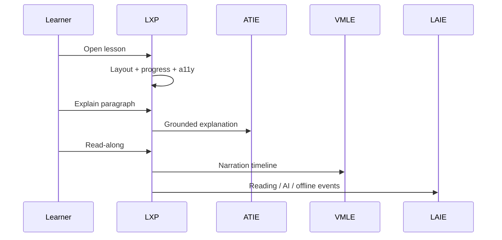

# Intelligent Learning Experience Platform (LXP) — Phases 1–3

**Product:** Alora AI / EduAdapt  
**Smoke (P1+P2):** `LXP_PHASE1_PHASE2_SMOKE_OK`  
**Smoke (P3):** `LXP_PHASE3_COLLAB_REVISION_SMOKE_OK`  
**Smoke (P4):** `LXP_PHASE4_PREMIUM_EXPERIENCE_SMOKE_OK`  
**Engine:** `engines/learning_experience_platform/` (`engine_id=learning_experience`)  
**UI:** `ui/lxp/` (reader) + `ui/learning_experience_platform/` (+ `premium/`)

LXP is the **premium unified learning workspace**. It consumes VLIE engines and never invents curriculum.

Phase 3: [`LXP_PHASE3_COLLABORATION_REVISION.md`](./LXP_PHASE3_COLLABORATION_REVISION.md)  
Phase 4: [`LXP_PHASE4_PREMIUM_EXPERIENCE.md`](./LXP_PHASE4_PREMIUM_EXPERIENCE.md)

---

## Phase 1 — Core Reader

| Capability | Module |
|------------|--------|
| Layout (nav / reading / AI panel / sticky toolbar / footer) | `layout.py` |
| TOC, breadcrumbs, next/prev, resume | `navigation.py` |
| Themes (light/dark/sepia/high contrast) + modes | `themes.py`, `schemas.py` |
| Progress + LAIE reader payload | `progress.py` |
| Notes / highlights / bookmarks | `session_store.py` |
| Search (lesson/notes/glossary) | `search.py` |
| AIE accessibility bridge | `accessibility.py` |
| Offline cache + conflict-safe sync | `offline.py` |

---

## Phase 2 — Interactive Intelligence

| Capability | Integrates |
|------------|------------|
| AI Explain / Simplify / Summarize… | ATIE (`ai_explain.py`) |
| Contextual chat | ATIE (`contextual_chat.py`) |
| Click-to-explain | CIE / UCF / ATIE (`click_explain.py`) |
| Vocabulary | UCF glossary + VMLE pronunciation |
| Read-along | VMLE (`read_along.py`) |
| Interactive STEM | Verified STEM / VMLE multimodal (`stem.py`) |
| Glossary / Summary | Verified lesson + CIE/SAE |
| Tutor panel | ATIE |
| Companion | ALCIS (non-interruptive) |
| Motivation strip | LMAS (compact) |
| Voice | VMLE |
| Analytics | LAIE (`analytics.py`) |

---

## Interaction flow



---

## UI entry

```python
from ui.lxp import render_lxp_reader
render_lxp_reader(lesson_text=..., topic=..., learner_id=..., adaptations=...)
```

Existing `viewer_page.render_adaptation_viewer` remains the lesson body renderer.

---

## Offline architecture

`data/knowledge/lxp/offline/{cache_id}.json` stores lesson payload, notes, bookmarks, highlights, progress, audio meta.  
`sync_cache` merges by higher `reading_pct` / newer timestamp (no silent data loss).

---

## Accessibility

WCAG 2.2 AA target: theme, font, spacing, ruler, focus mode, keyboard, screen-reader-friendly structure. Presentation-only via AIE.

---

## Component library

| Layer | Location | Role |
|-------|----------|------|
| Engine | `engines/learning_experience_platform/` | Session, prefs, notes, offline, Phase 2 adapters |
| Service API | `service.py` | Stable facade for UI / future REST |
| Streamlit shell | `ui/lxp/reader.py` | Toolbar, TOC, AI panel, footer; wraps `viewer_page` |
| VLIE | `engine_id=learning_experience` | Registry + light orchestration pass |

## API surface (`service.py`)

| API | Purpose |
|-----|---------|
| `api_open_reader` | Open session + layout + Phase 2 bundle |
| `api_update_preferences` / `api_get_preferences` | Themes, modes, a11y prefs |
| `api_update_progress` | Reading % / time → LAIE |
| `api_add_note` / `api_list_notes` / `api_delete_note` | Notes |
| `api_add_highlight` / `api_list_highlights` | Highlights |
| `api_add_bookmark` / `api_list_bookmarks` | Bookmarks + folders |
| `api_search` | Lesson / notes / glossary search |
| `api_offline_cache` / `api_offline_sync` | Offline foundation |
| `api_explain_paragraph` / `api_chat` / `api_click_explain` | ATIE-grounded help |
| `api_glossary` / `api_summary` / `api_read_along` / `api_stem` | Phase 2 intelligence |

## Testing

```bash
pytest tests/test_lxp.py -v
```

Smoke prints **`LXP_PHASE1_PHASE2_SMOKE_OK`**.

Coverage: themes, navigation/layout, notes/highlights/bookmarks, offline conflict merge, Phase 2 APIs, AIE prefs, VLIE registry, legacy engine regression.

---

## Later milestones

Multi-board expansion UX and advanced IRT analytics — see `SECTION_C_FUTURE_ROADMAP.md`.
