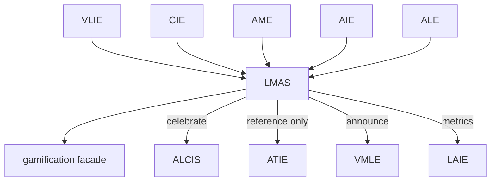

# Learning Motivation & Achievement System (LMAS)

**Product:** Alora AI / EduAdapt  
**Smoke:** `LMAS_SMOKE_OK`  
**Package:** `engines/learning_motivation_engine/`  
**VLIE ids:** `learning_motivation` (+ legacy facade `gamification`)

LMAS is the **engagement and motivation layer** — not a game. Intrinsic motivation first; no dark patterns, pay-to-win, or public competitive leaderboards. Curriculum and assessment stay unchanged.

---

## 1. Architecture



---

## 2. Data model

Persisted: `data/knowledge/lmas/learners/{learner_id}.json`

Fields: `xp_total`, `xp_log`, `level_id`, `badges`, `achievements`, `quests`, `streaks` (grace/recovery), `certificates` (QR + signature), `skill_tree_progress`, `journey`, `last_event_hashes` (anti-farming).

---

## 3. Event flow

`MotivationXPAwarded`, `MotivationCertificateIssued`, `MotivationQuestCompleted` → VLIE bus; analytics → LAIE.

---

## 4. APIs (`service.py`)

XP, achievements, quests, skill trees, journeys, certificates, streaks, rewards, analytics, role dashboards (learner/teacher/parent/special educator).

---

## 5. Policy & accessibility

- Intrinsic before extrinsic  
- Grace days; never punish missed days  
- AIE adjusts notification style, visual complexity, celebration intensity  
- No medical labels  

---

## 6. Integration notes

| Engine | Role |
|--------|------|
| Gamification facade | Mirrors LMAS payload for ALCIS/LAIE back-compat |
| ALCIS | Celebrates XP/badges via existing celebration APIs |
| ATIE | May reference achievements only |
| VMLE | Speakable announcements |

---

## 7. Testing & deploy

```bash
pip install -r requirements-dev.txt
pytest tests/test_lmas.py -v
```

Smoke: **`LMAS_SMOKE_OK`**.

---

## 8. Migration

| Before | After |
|--------|-------|
| Stub `gamification` XP=0 | LMAS persistence + formulas |
| Deferred Section C note | LMAS owns economy; facade kept |

---

## 9. Product next (after LMAS)

1. Intelligent Lesson Reader  
2. Teacher / Special Educator / Parent workspaces  
3. Multi-board curriculum expansion  
