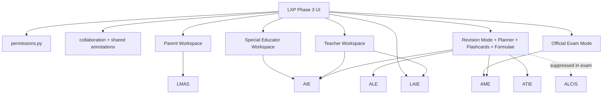

# Learning Experience Platform — Phase 3

**Collaboration · Workspaces · Revision · Assessment**  
**Smoke:** `LXP_PHASE3_COLLAB_REVISION_SMOKE_OK`  
**Engine:** `engines/learning_experience_platform/` (v1.3)  
**UI:** `ui/learning_experience_platform/` (unified LXP tabs)

Phase 3 extends the same LXP flagship workspace. It does **not** replace VLIE/AME/ALE/AIE/ATIE — it orchestrates them.

Phases 1–2 remain unchanged for the core reader.

---

## Architecture



---

## Collaboration & security

| Role | Key permissions |
|------|-----------------|
| Student | Private annotations, reply, revision, flashcards, exam practice |
| Teacher | Comments, pins, locks, assignments, announce, resolve, class tracking |
| Parent | View progress, encouragement, home notes — **never alter curriculum** |
| Special educator | AIE accommodations, IEP/therapy notes, goals, observations |
| Administrator | Full |

Annotation visibility: `private` · `teacher_only` · `parent_only` · `shared_classroom` · `special_educator`  
Version history stored on each shared annotation.

Data: `data/knowledge/lxp/collaboration/`

---

## Workspaces

- **Teacher** — teaching notes, pins, locks, assignments, reading/AI/revision tracking, A11y compare
- **Parent** — progress, teacher comments, encouragement, planner/achievements (read-only curriculum)
- **Special educator** — AIE recommendations, EF supports, IEP/therapy/goal notes

---

## Revision & assessment

| Feature | Source of truth |
|---------|-----------------|
| Revision mode | CIE summaries + AME misconceptions + AIE presets |
| Flashcards | Verified word wall / CIE / SAE (+ ALE spaced repetition) |
| Formula sheets | SAE / STEM engines only — **no invented formulas** |
| Exam mode | AME official banks — companion suppressed |
| Revision planner | AME revision plan + ALE schedule + a11y pace |

---

## APIs (`service.py`)

`api_add_comment` · `api_list_comments` · `api_shared_annotation` · `api_teacher_workspace` · `api_parent_workspace` · `api_special_educator_workspace` · `api_revision_mode` · `api_flashcards` · `api_formula_sheets` · `api_exam_mode` · `api_official_exam` · `api_revision_planner` · `api_ai_revision` · `api_notifications` · `api_phase3`

---

## Offline sync

Phase 1 offline cache remains authoritative for lesson/notes/bookmarks. Collaboration threads sync when online; annotation version history prevents silent overwrite (higher version / newer timestamp wins on conflict).

---

## Testing

```bash
pytest tests/test_lxp_phase3.py tests/test_lxp.py -v
```

Smoke prints **`LXP_PHASE3_COLLAB_REVISION_SMOKE_OK`**.
