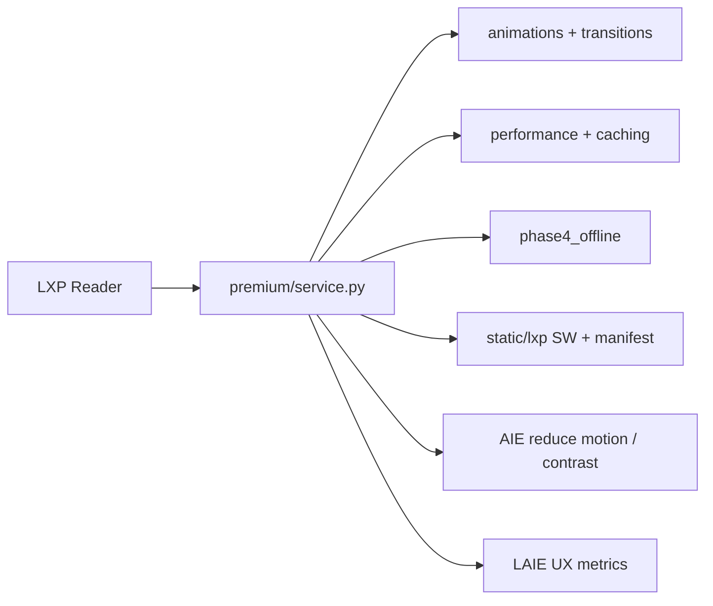

# LXP Phase 4 — Premium Experience, Performance & Polish

**Smoke:** `LXP_PHASE4_PREMIUM_EXPERIENCE_SMOKE_OK`  
**UI:** `ui/learning_experience_platform/premium/`  
**Engine helpers:** `phase4*.py` (settings, offline sync, analytics)  
**PWA assets:** `static/lxp/`

Phase 4 elevates UX only. It does **not** add intelligence engines or invent curriculum.

---

## Premium experience architecture



Motion is optional and respects `prefers-reduced-motion` + user `reduce_motion`. Content always renders first.

---

## Performance

| Technique | Status |
|-----------|--------|
| Lazy loading / progressive sections | Planned in UI + flagged in phase4 payload |
| Virtual scroll threshold | 40+ items |
| Diagram / formula cache | `premium/caching.py` |
| Prefetch next lesson | Flag enabled |
| Page load timing → LAIE | `ux_page_load` |

Targets: fast first paint, ~60 FPS scrolls where practical, low memory, efficient offline storage.

---

## Offline synchronization

Full packages: lesson, notes, highlights, bookmarks, comments, flashcards, revision plans, voice meta, glossary, companion memory, preferences.

- Delta queue with retries  
- Conflict detect + strategies (`local_wins` / `remote_wins` / `merge_by_timestamp`)  
- Background sync + status indicator  
- Storage optimization report  

Data: `data/knowledge/lxp/sync/`

---

## PWA

- `static/lxp/manifest.webmanifest`  
- `static/lxp/sw.js` (cache shell, sync tag, optional push)  
- Graceful fallback when SW unsupported  

Serve `/static/lxp/` from the host app for installability.

---

## Responsive · gestures · i18n · a11y

- Breakpoints: mobile → whiteboard / foldable hooks  
- Gestures with keyboard equivalents  
- UI locales (`en`, `hi`, …); **curriculum translation = approved bundles only**  
- WCAG 2.2 AA checklist, focus rings, 44px targets, shortcut overlay  

---

## Settings & notifications

Unified panel: theme, language, font, a11y, audio, companion, notifications, offline quota, privacy, sync.

---

## Testing

```bash
pytest tests/test_lxp_phase4.py tests/test_lxp_phase3.py tests/test_lxp.py -q
```

Smoke prints **`LXP_PHASE4_PREMIUM_EXPERIENCE_SMOKE_OK`**.

---

## Deployment notes

1. Expose `static/lxp/` as static files.  
2. Link manifest + register SW in the host HTML shell when available.  
3. Prefer HTTPS for install + background sync.  
4. Do not ship auto-translated NCERT/CIE text without approved locale bundles.
