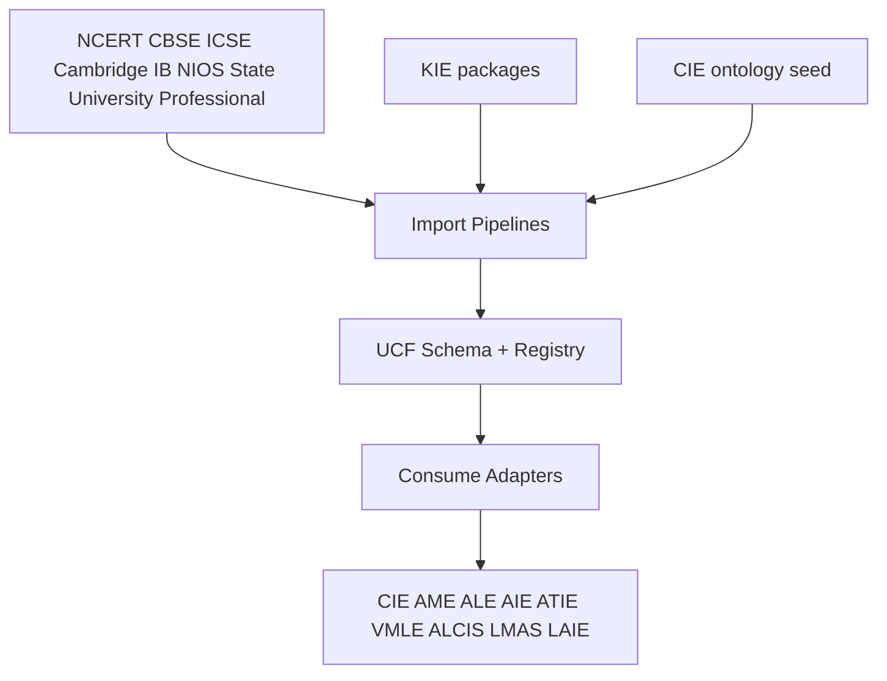

# Universal Curriculum Framework (UCF)

**Product:** Alora AI / EduAdapt  
**Smoke:** `UCF_SMOKE_OK`  
**Package:** `engines/universal_curriculum_framework/`  
**VLIE id:** `universal_curriculum` (priority 8, before CIE `curriculum`)

UCF is **not** a curriculum. It is the **single internal academic schema** into which every board, university syllabus, and certification framework is transformed. Engines consume UCF projections instead of board-specific structures.

---

## 1. Architecture



---

## 2. Entity model (summary)

`BoardMetadata` → `UCFPackage` → `UCFTopic` (+ objectives, competencies, taxonomies, prerequisites, assessment, accessibility)  
Repositories: formulae, diagrams, glossary, questions (official preferred).

JSON schema: `schema: "ucf/1.0"`.

---

## 3. Knowledge graph

`prerequisites.build_dependency_graph` → nodes/edges (`requires` / cross-disciplinary links).  
CIE projection via `mapping.ucf_package_to_cie_payload`.

---

## 4. Import pipelines

Importers: `ncert`, `cbse`, `icse`, `isc`, `cambridge`, `ib`, `nios`, `state_board`, `university`, `professional`, `kie_package`, `cie_ontology`.

Adding a board = new importer + mapping, **not** engine rewrites.

---

## 5. APIs (`service.py`)

Import · Validate · Search · Topic · Competency · Formula · Figure · Question bank · Glossary · Objectives · Prerequisites · Metadata · Index · Migrate.

---

## 6. Integration (thin consume)

| Engine | Adapter |
|--------|---------|
| CIE | `adapters.for_cie` + CurriculumEngine merges UCF concepts |
| AME | `for_ame` assessment metadata |
| ALE | `for_ale` prerequisite graph |
| AIE | `for_aie` accessibility metadata |
| ATIE | `for_atie` verified concepts |
| VMLE | `for_vmle` narration objects |
| ALCIS | `for_alcis` competency celebration hooks |
| LMAS | `for_lmas` skill-tree concepts (preferred in `skill_tree.py`) |
| LAIE | `for_laie` universal competencies |
| KIE | emit via `kie_package` importer |

---

## 7. Persistence

```
data/knowledge/ucf/packages/{package_id}.json
data/knowledge/ucf/registry.json
```

Gitignored.

---

## 8. Migration strategy

1. Import pilot CIE ontology → UCF (`ensure_pilot_ucf`).  
2. CIE continues to run; consumes UCF when present.  
3. New boards: importer only.  
4. Versioning: `migrate_version` + deprecate.

---

## 9. Testing

```bash
pytest tests/test_ucf.py -v
```

Smoke: **`UCF_SMOKE_OK`**.
