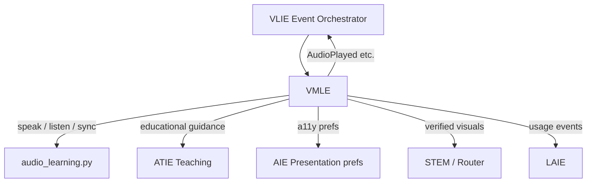
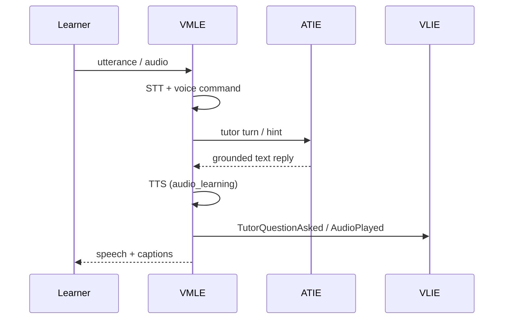

# Voice & Multimodal Learning Experience (VMLE)

**Product:** Alora AI / EduAdapt  
**Smoke:** `VMLE_SMOKE_OK`  
**Package:** `engines/voice_multimodal_learning/`  
**VLIE id:** `voice_multimodal`

VMLE is the **presentation and interaction layer** — not a TTS gimmick and not a replacement for ATIE, AIE, or STEM engines.

---

## 1. Architecture



**Policy:** ATIE = teaching intelligence · STEM = deterministic facts · VMLE = speech, media sync, interaction UX.

---

## 2. Components

| Module | Role |
|--------|------|
| `conversation.py` | Voice commands + STT→ATIE→TTS loop |
| `narration.py` / `text_to_speech.py` | Wrap `audio_learning` |
| `speech_to_text.py` | Client/Web Speech + optional server STT |
| `read_along.py` / `highlighting.py` | Word/sentence/paragraph sync |
| `pronunciation.py` | Listen/repeat/compare (curated + heuristic; no LLM IPA) |
| `multimodal.py` + `interactive_*` | STEM interaction descriptors |
| `multilingual.py` | Language / dual mode / glossary hooks |
| `accessibility.py` | Consume AIE |
| `offline.py` / `session_memory.py` | Cache + resume |
| `synchronization.py` | Publish to VLIE events |
| `service.py` | REST-shaped APIs |
| `engine.py` | VLIE `BaseEngine` facade |

---

## 3. Sequence — voice tutor turn



---

## 4. APIs (`service.py`)

| API | Purpose |
|-----|---------|
| `api_start_voice_session` / `api_end_voice_session` | Lifecycle |
| `api_speech_to_text` / `api_text_to_speech` | STT / TTS |
| `api_read_along_state` / `api_read_along_control` | Read-along |
| `api_pronunciation_feedback` | Pronunciation |
| `api_voice_command` | Natural commands |
| `api_conversational_turn` | Full voice↔ATIE loop |
| `api_interactive_content` | STEM multimodal |
| `api_offline_sync` | Offline cache/sync |
| `api_multilingual_settings` | Language |
| `api_usage_analytics` | → LAIE-shaped metrics |

---

## 5. Persistence

```
data/knowledge/vmle/sessions/
data/knowledge/vmle/offline/
```

Gitignored.

---

## 6. Event flow (VLIE)

`AudioPlayed`, `DiagramViewed`, `TutorQuestionAsked`, `TutorResponseReceived`, `AccessibilityChanged`, plus `VoiceCommandReceived`, `PronunciationScored`, `ReadAlongProgress`, `OfflineSynced`.

---

## 7. Accessibility

Consumes AIE automatically: dyslexia-friendly speed, ADHD focus, captions, reduced motion, keyboard/switch — **presentation only**.

---

## 8. Offline sync

Cache lesson text, audio metadata, diagrams, assessments, session state → `synchronize(cache_id)` marks synced and signals VLIE/LAIE.

---

## 9. Security & privacy

- Prefer on-device Web Speech where possible.
- Do not persist raw audio by default in API responses (`include_audio_bytes=False`).
- Tenant/learner isolation via session ids; encrypt at rest in production deployments.
- Parent/teacher controls gate narration and usage visibility.

---

## 10. Testing & deployment

```bash
pip install -r requirements-dev.txt
pytest tests/test_vmle.py -v
```

Smoke prints **`VMLE_SMOKE_OK`**.

Register: `engine_manager.register(VoiceMultimodalEngine(), depends_on=[accessibility, ai_tutor, scientific_accuracy])`.

---

## 11. Migration notes

| Before | After |
|--------|-------|
| Streamlit-only `audio_learning` panel | Headless TTS/STT APIs + same `audio_learning` core |
| Planned `voice_multimodal` slot | Real engine in registry |
| ATIE multimodal flags only | VMLE executes speech/sync around ATIE text |

No changes to KIE/CIE/AME/AIE/ALE/LAIE/ATIE business logic. VLIE gains optional light-pass inclusion of `voice_multimodal`.
